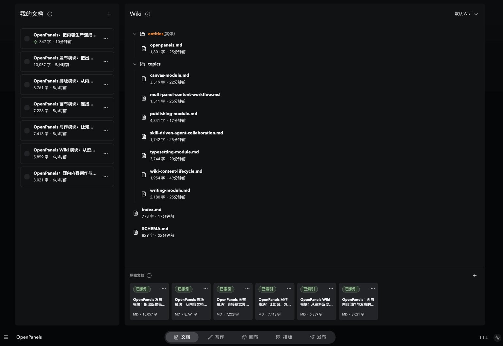
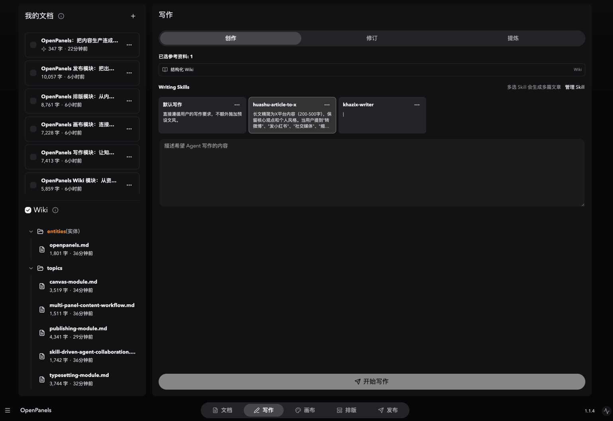
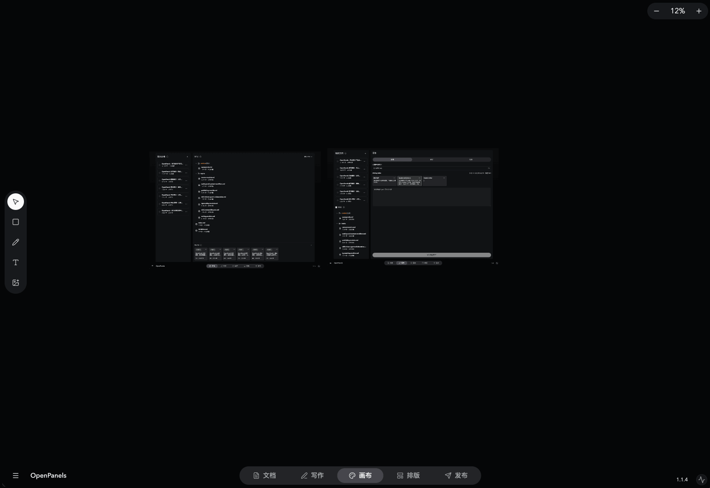
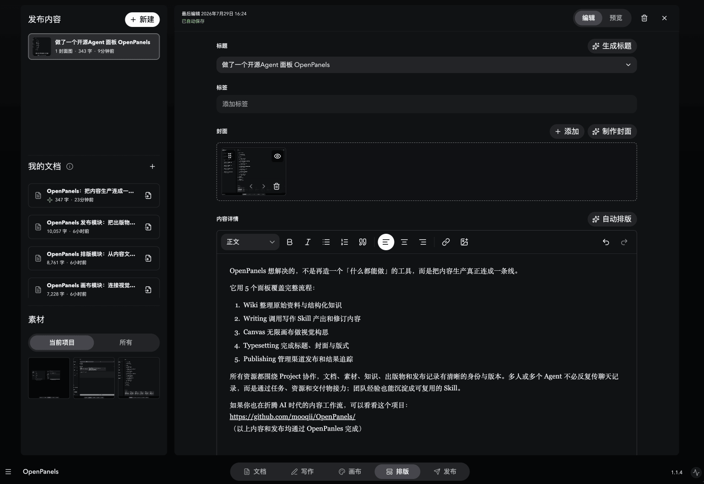
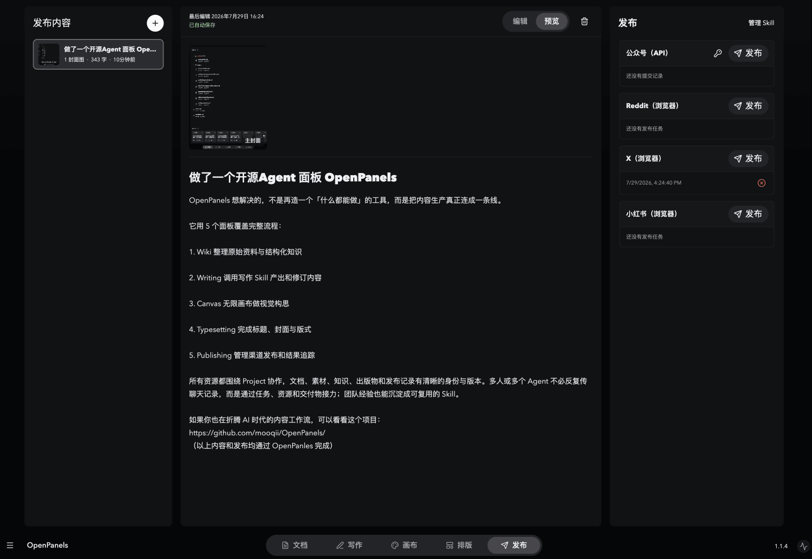

# MyOpenPanels

[English](README.md) | 简体中文

MyOpenPanels 是一个面向 AI Agent 的本地优先可视化工作台。

## 安装

把下面这段话发送给你的 AI Agent：

```text
请从下面的地址安装 MyOpenPanels Agent Skill：
https://github.com/mooqii/OpenPanels/tree/main/skills/myopenpanels

请使用 Skill 安装工具，并且只安装这个目录。安装后调用一次
MyOpenPanels，完成初始化并打开 Studio。
```

安装完成后，只需告诉 Agent：

```text
打开 MyOpenPanels。
```

首次运行时，Skill 会自动安装或检查原生 `myopenpanels` CLI，启动本地
Studio 并将它打开。目前 MyOpenPanels 支持 macOS 和 Windows。

## AI Agent 的可视化工作台

AI Agent 擅长推理和生成内容，但聊天窗口并不适合组织长期知识、编辑视觉素材，
也难以承载从写作到发布的完整工作流。

MyOpenPanels 为能够运行本地命令的 AI Agent 提供了一个共享可视化工作台。你和
Agent 可以在同一个项目中，通过持久化面板、明确的内容选择、可复用的 Skill
以及可见的任务状态持续协作。项目内容保存在你的电脑上，原生 CLI 负责连接
Agent 与 Studio。

当前工作流由五个面板组成：

- **Wiki**：持续积累的结构化知识
- **Writing**：创建和修改文档
- **Canvas**：视觉思考和图像处理
- **Typesetting**：将内容整理为可发布的作品
- **Publishing**：把作品发布到目标平台

https://github.com/user-attachments/assets/58c3e174-8369-4720-9d64-e1168ec2749b

[在 YouTube 上观看](https://www.youtube.com/watch?v=6I8ZIPALg54)

## Wiki

Wiki 可以把来源资料整理成一个持续生长的结构化知识空间。你可以导入文件或
Markdown，建立不同的 Wiki 空间，并让 Agent 维护相互链接的 Markdown 页面，
避免每次工作都重新查找和理解相同的信息。

你可以把整个 Wiki 或指定文档选择为 Agent 的上下文。原始资料与整理后的 Wiki
会同时保留，既方便研究和追溯，也可以继续用于后续写作。



## Writing

Writing 使用选中的 Wiki 知识和文档作为参考资料，完成明确的写作任务。它支持
创建新文档、修改已有文档，并可以应用一个或多个 Writing Skill，生成不同风格、
结构或编辑方法的内容。

你还可以从选中的示例文章中提炼出可复用的 Writing Skill。完成的内容会保存为
持久化文档，并可以继续进入 Typesetting 和 Publishing 工作流。



## Canvas

Canvas 是一个持久化的可视化空间，可以自由组织想法、图片、文本、图形、绘画
和连接线，适合制作图表、情绪板、头脑风暴、视觉研究和发布素材。

Agent 可以读取你明确选中的内容，插入或生成图片，编辑选中的图片，并导出选区。
这样，人和 Agent 的协作会围绕具体对象展开，而不需要依赖对整张画布的模糊描述。



## Typesetting

Typesetting 用于把文档整理成可发布的作品。你可以编辑富文本，插入文档和
Canvas 素材，管理标题、封面、标签及媒体内容，并在编辑和最终预览之间切换。

标题、封面和排版 Skill 可以把具体任务交给 Agent，同时让生成结果始终保持可见、
可编辑。Typesetting 是成稿与目标平台发布格式之间的连接环节。



## Publishing

Publishing 会捕获当前作品的确定版本，并通过选中的 Publishing Skill 执行发布。
每个发布版本都会保留自己的尝试和结果，让等待中、执行中、已完成、结果未知或
失败的任务都有清晰记录。

Publishing Skill 可以描述不同平台的发布流程。MyOpenPanels 目前还提供微信公众号
草稿的直接 API 集成，并在本地保存凭据和执行配置校验。


